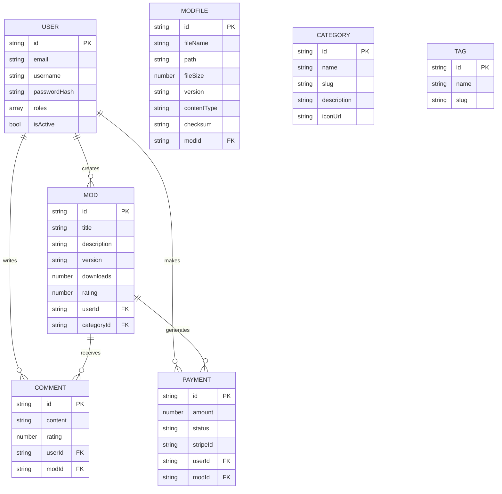

# Cahier des Charges Technique
## Plateforme ModHub - Solution SaaS pour Mods Gaming


---

> **Document v1.0** | 30/06/2025 | Équipe Technique ModHub

---

## Table des Matières

### **Architecture & Conception**

| Section | Description | Status |
|---------|-------------|--------|
| [1. Introduction et Contexte](#1-introduction-et-contexte) | Vue d'ensemble du projet | ✅ |
| [2. Architecture Générale](#2-architecture-générale) | Design système global | ✅ |
| [3. Spécifications Techniques](#3-spécifications-techniques) | Technologies et frameworks | ✅ |
| [4. Microservices et APIs](#4-microservices-et-apis) | Services et endpoints | ✅ |
| [5. Base de Données et Modèles](#5-base-de-données-et-modèles) | Modélisation des données | ✅ |

### **Sécurité & Infrastructure**

| Section | Description | Status |
|---------|-------------|--------|
| [6. Sécurité et Authentification](#6-sécurité-et-authentification) | Stratégie de sécurité | ✅ |
| [7. Infrastructure et Déploiement](#7-infrastructure-et-déploiement) | DevOps et déploiement | ✅ |
| [8. Monitoring et Observabilité](#8-monitoring-et-observabilité) | Surveillance système | ✅ |
| [9. Interface Utilisateur](#9-interface-utilisateur) | Design et UX/UI | ✅ |
| [10. Diagrammes UML et Architecture](#10-diagrammes-uml-et-architecture) | Modélisation visuelle | ✅ |

### **Performance & Qualité**

| Section | Description | Status |
|---------|-------------|--------|
| [11. Performances et Scalabilité](#11-performances-et-scalabilité) | Optimisation système | ✅ |
| [12. Tests et Qualité](#12-tests-et-qualité) | Stratégie de test | ✅ |
| [13. Conformité RGPD](#13-conformité-rgpd) | Protection des données | ✅ |
| [14. Roadmap Technique](#14-roadmap-technique) | Évolution future | ✅ |
| [15. Annexes](#15-annexes) | Ressources additionnelles | ✅ |

---

## 1. Introduction et Contexte

### **Vision et Objectifs**

*ModHub: référence mondiale pour la distribution et création de mods gaming*

**Plateforme SaaS** dédiée au partage, à la découverte et à la monétisation de mods de jeux vidéo, offrant:
- **Architecture scalable**: Microservices, millions d'utilisateurs potentiels
- **Sécurité**: JWT, RGPD, scan antivirus, WAF
- **Performance**: Support fichiers volumineux (2 Go/mod), cache intelligent
- **Monétisation**: Intégration Stripe, abonnements et mods premium
- **Communauté**: Notation, commentaires, modération avancée

### **Phases de Développement**

| Phase | Statut | Éléments clés |
|-------|--------|---------------|
| **Infrastructure** | ✅ | Docker, Ocelot, MongoDB, JWT |
| **Features Core** | ✅ | Auth, Upload/download, Recherche |
| **Premium** | ⏳ | Paiements, Abonnements, Analytics |
| **Évolution** | 🔮 | IA, Social, Marketplace, Intégrations |

---

## 2. Architecture Générale


### 2.1 Vue d'Ensemble

```
┌────────────┐   ┌────────────┐   ┌────────────┐
│ Frontend   │◄──┤ API Gateway│◄──┤ Load       │
│ Blazor WASM│   │ (Ocelot)   │   │ Balancer   │
└────────────┘   └────────────┘   └────────────┘
                       │
        ┌──────────────┼──────────────┐
        │              │              │
  ┌─────▼────┐   ┌────▼─────┐   ┌────▼────┐
  │Users     │   │Mods      │   │Payment  │
  │Service   │   │Service   │   │Service  │
  └─────┬────┘   └────┬─────┘   └────┬────┘
        │             │              │
  ┌─────▼────┐   ┌────▼─────┐   ┌────▼────┐
  │Community │   │File      │   │Notif    │
  │Service   │   │Service   │   │Service  │
  └─────┬────┘   └──────────┘   └─────────┘
        │
  ┌─────▼────────────────────────────────┐
  │  MongoDB                             │
  └──────────────────────────────────────┘
```

### 2.2 Patterns et Communications

**Patterns Clés**

| Pattern | Caractéristiques principales |
|---------|------------------------------|
| **DDD** | • Domaines métier séparés<br>• Modèles riches avec logique encapsulée |
| **CQRS** | • Séparation lecture/écriture<br>• Optimisation performances |
| **Event Sourcing** | • Audit trail pour opérations critiques |

**Communication**
- **REST/HTTP**: Opérations CRUD, JWT Bearer, OpenAPI
- **Asynchrone**: RabbitMQ, traitement fichiers, notifications
- **Résilience**: Circuit Breaker, retry policies, health checks


---

## 3. Spécifications Techniques

### 3.1 Stack & Technologies

| Composant | Technologie | Caractéristiques |
|-----------|-------------|------------------|
| **Runtime** | .NET 9.0 | LTS, performances optimales |
| **Frontend** | Blazor WebAssembly 8.0 | SPA moderne C# |
| **UI** | MudBlazor 8.7.0 | Material Design |
| **API Gateway** | Ocelot 23.3+ | Routage centralisé |
| **Database** | MongoDB 7.0+ | NoSQL scalable |
| **Sécurité** | JWT, Identity, Argon2id | Authentification sécurisée |
| **Paiements** | Stripe API 4.0+ | Intégration complète |
| **Ops** | Docker 27.0+, Nginx 1.26+ | Containerisation, load balancing |
| **Monitoring** | Prometheus/Grafana, ELK | Métriques et logs centralizés |

### 3.2 Performances & Sécurité

**Exigences Performance**

| Métrique | Objectif | Capacité |
|-----------|----------|-----------|
| **Temps de réponse** | API < 50ms, Web < 2s | Support haute disponibilité |
| **Throughput** | 10,000 req/sec | 1,000 uploads simultanés |
| **SLA** | 99.9% | RTO < 15min, RPO < 5min |

**Sécurité**
- **Accès**: JWT + refresh tokens, MFA (TOTP), Rôles hiérarchiques
- **Données**: AES-256 (repos), TLS 1.3 (transit), Conformité RGPD
- **Fichiers**: Scanning antivirus, validation MIME, signatures numériques

### 3.3 Contraintes & Compatibilité

**Fichiers & Formats**
- Mods: max 2 Go/fichier, 5 Go/projet
- Archives: .zip, .7z, .rar, .tar.gz
- Média: .jpg, .png, .webp, .svg (.mp4, .gif limités)

**Support Navigateurs**
- Chrome/Edge 120+, Firefox 121+, Safari 17+
- Design responsive mobile/tablette


---

## 4. Microservices et APIs

### 4.1 Architecture API

**Gateway (Ocelot)**

| Route | Service | Fonctionnalités principales |
|-------|---------|-------------------------|
| `/api/v1/users/*` | **UsersService** | Authentification, profils utilisateurs, rôles |
| `/api/v1/mods/*` | **ModsService** | Publication, recherche, téléchargement |
| `/api/v1/payments/*` | **PaymentsService** | Abonnements, transactions, webhooks Stripe |
| `/api/v1/community/*` | **CommunityService** | Forums, notation, modération |

### 4.2 Services Principaux

**UsersService**
```http
POST /api/auth/register     # Création compte
POST /api/auth/login        # Authentification
GET  /api/users/profile     # Profil utilisateur
POST /api/passwordreset     # Reset sécurisé
```

**ModsService**
```http
GET  /api/mods              # Recherche avancée + filtres
POST /api/mods              # Upload avec validation
GET  /api/mods/{id}         # Détails complets
POST /api/mods/{id}/download # Téléchargement sécurisé
POST /api/mods/{id}/rate    # Notation communautaire
```

**PaymentsService**
- Intégration Stripe PCI DSS conforme
- Gestion abonnements, transactions one-time
- Webhooks pour événements de paiement

### 4.3 Services Support

**Services auxiliaires** assurant des fonctions essentielles:

| Service | Fonctions clés |
|---------|---------------|
| **FileService** | Gestion fichiers volumineux, CDN, optimisations |
| **CommunityService** | Forums, commentaires, signalements |
| **ModerationService** | Dashboard modération, gestion signalements, sanctions utilisateurs |
| **NotificationService** | Temps réel (SignalR), emails, push notifications |
- Analytics de recherche

**AdminService** (Port :80)
- Dashboard administration
- Métriques et KPI
- Gestion utilisateurs


---

## 5. Base de Données et Modèles

### 5.1 Architecture de Données

| Stockage | Rôle principal | Caractéristiques |
|----------|--------------|------------------|
| **MongoDB** | Base principale | • Collections par domaine<br>• Réplication (3 nodes)<br>• Sharding géographique |
| **Redis** | Cache et sessions | • Cache L2<br>• Sessions<br>• Rate limiting |
| **Elasticsearch** | Recherche | • Index full-text<br>• Logs<br>• Analytics |

### 5.2 Modèle Conceptuel de Données (MCD)



### 5.3 Collections MongoDB

| **Collections Principales** | **Collections Secondaires** |
|----------------------------|-----------------------------|
| - Users                     | - Sessions                 |
| - Mods                      | - Reports                  |
| - Categories                | - Analytics                |
| - Comments                  | - MessageThreads           |
| - Payments                  | - Messages                 |
| - ModFiles                  |                            |
| - Notifications             |                            |

**Exemples de Documents :**

```json
// Users
{
  "_id": "ObjectId('60d21b4667d0d8992e610c85')",
  "email": "user@modhub.ovh",
  "username": "modmaster",
  "passwordHash": "$argon2id$v=19$m=65536,t=3,p=4$...",
  "roles": ["user", "creator"],
  "profile": { 
    "displayName": "Mod Master", 
    "avatarUrl": "/images/avatars/user1.webp", 
    "socialLinks": ["https://github.com/modmaster"]
  },
  "preferences": { 
    "emailNotifications": true, 
    "theme": "dark"
  },
  "createdAt": "2025-06-15T10:23:54Z",
  "isActive": true
}

// Mods
{
  "_id": "ObjectId('60d21b9c67d0d8992e610c86')",
  "title": "Enhanced Graphics Pack",
  "description": "Améliore les textures et effets visuels du jeu",
  "version": "2.1.5",
  "versionHistory": [
    { 
      "version": "2.1.5", 
      "changes": "Optimisation des performances", 
      "fileId": "ObjectId('60d21bb567d0d8992e610c87')" 
    }
  ],
  "downloads": 15426,
  "rating": { "average": 4.7, "count": 342 },
  "tags": ["graphics", "visuals", "performance"],
  "price": { "amount": 5.99, "currency": "EUR", "type": "onetime" },
  "userId": "ObjectId('60d21b4667d0d8992e610c85')",
  "categoryId": "ObjectId('60d21b2667d0d8992e610c84')",
  "status": "published"
}

// ModFiles
{
  "_id": "ObjectId('60d21bb567d0d8992e610c87')",
  "fileName": "enhanced-graphics-v2.1.5.zip",
  "path": "/storage/mods/60d21b9c/enhanced-graphics-v2.1.5.zip",
  "fileSize": 157483982,
  "version": "2.1.5",
  "contentType": "application/zip",
  "checksum": "sha256:8a9d3e4e57f35db232f0e7c3b922cda9b07f4e7c114334ea45",
  "modId": "ObjectId('60d21b9c67d0d8992e610c86')"
}
```

**Structure des données:**
- Relations via ObjectId entre collections
- Index optimisés pour recherches fréquentes
- Validation des schémas (JSON Schema)

### 5.4 Index et Optimisations

**Index Principaux :**
- Users : email, username (uniques), roles
- Mods : recherche full-text, author, tags, catégories, ratings
- Comments : modId, userId, parentId
- Performance optimisée pour les requêtes fréquentes

**Stratégies de Cache :**
- Mods populaires : TTL 15 minutes
- Profils utilisateurs : TTL 30 minutes
- Catégories : TTL 1 heure
- Recherches fréquentes : TTL 5 minutes

<div style="text-align: right; font-style: italic; color: #666;">Page 5</div>


---

## 6. Sécurité et Authentification


> **Sécurité de Niveau Entreprise**  
> Implémentation des **meilleures pratiques OWASP**, **authentification multi-facteurs** et **chiffrement bout-en-bout**

### 6.1 Architecture de Sécurité

```
┌─────────────────┐    ┌─────────────────┐    ┌─────────────────┐
│   Web Client    │    │   API Gateway   │    │  Auth Service   │
│                 │    │     (Ocelot)    │    │   (JWT Auth)    │
│ • JWT Storage   │◄──►│ • JWT Validation│◄──►│ • User Login    │
│ • Auto Refresh  │    │ • Rate Limiting │    │ • Token Issue   │
│ • Secure Cookies│    │ • CORS Policy   │    │ • Refresh Token │
└─────────────────┘    └─────────────────┘    └─────────────────┘
         │                       │                       │
         │              ┌────────▼────────┐             │
         │              │   Security      │             │
         │              │   Middleware    │             │
         │              │                 │             │
         │              │ • Input Valid.  │             │
         │              │ • XSS Protection│             │
         │              │ • CSRF Tokens   │             │
         │              │ • SQL Injection │             │
         │              └─────────────────┘             │
         │                       │                      │
         └───────────────────────┼──────────────────────┘
                                 │
         ┌───────────────────────▼──────────────────────┐
         │              Audit & Logging                │
         │ • Request/Response Logs                     │
         │ • Security Events                           │
         │ • Failed Login Attempts                     │
         │ • Suspicious Activity Detection             │
         └─────────────────────────────────────────────┘
```

### 6.2 Authentification JWT

**Stratégie JWT**
- **Access Token** : Durée courte (15 minutes), contient claims utilisateur
- **Refresh Token** : Durée longue (7 jours), stocké en HttpOnly cookie
- **Rotation automatique** des refresh tokens
- **Révocation centralisée** via blacklist Redis

**Structure JWT Claims**
```json
{
  "sub": "user_id",
  "email": "user@example.com",
  "username": "modcreator123",
  "roles": ["user", "creator"],
  "permissions": ["mod:create", "mod:update", "payment:create"],
  "iat": 1703764800,
  "exp": 1703765700,
  "iss": "modhub.ovh",
  "aud": "modhub-api"
}
```

**Implémentation .NET**
```csharp
services.AddAuthentication(JwtBearerDefaults.AuthenticationScheme)
    .AddJwtBearer(options =>
    {
        options.TokenValidationParameters = new TokenValidationParameters
        {
            ValidateIssuer = true,
            ValidateAudience = true,
            ValidateLifetime = true,
            ValidateIssuerSigningKey = true,
            ValidIssuer = "modhub.ovh",
            ValidAudience = "modhub-api",
            IssuerSigningKey = new SymmetricSecurityKey(
                Encoding.UTF8.GetBytes(configuration["Jwt:SecretKey"])
            ),
            ClockSkew = TimeSpan.Zero
        };
        
        options.Events = new JwtBearerEvents
        {
            OnTokenValidated = async context =>
            {
                // Vérification blacklist Redis
                var tokenId = context.Principal.FindFirst("jti")?.Value;
                if (await _redisService.IsTokenBlacklisted(tokenId))
                {
                    context.Fail("Token has been revoked");
                }
            }
        };
    });
```

### 6.3 Autorisation Basée sur les Rôles

**Hiérarchie des Rôles**
```
Admin (Superadmin)
├── Moderator
│   ├── Community Manager
│   └── Content Reviewer
└── Creator
    ├── Premium Creator
    └── User (Basic)
        └── Guest (Non authentifié)
```

**Permissions par Rôle**

| Permission | Guest | User | Creator | Moderator | Admin |
|-----------|-------|------|---------|-----------|-------|
| **Mods** |
| View Public Mods | ✅ | ✅ | ✅ | ✅ | ✅ |
| Download Free Mods | ✅ | ✅ | ✅ | ✅ | ✅ |
| Create Mods | ❌ | ❌ | ✅ | ✅ | ✅ |
| Update Own Mods | ❌ | ❌ | ✅ | ✅ | ✅ |
| Delete Own Mods | ❌ | ❌ | ✅ | ✅ | ✅ |
| Moderate Any Mod | ❌ | ❌ | ❌ | ✅ | ✅ |
| **Community** |
| View Comments | ✅ | ✅ | ✅ | ✅ | ✅ |
| Post Comments | ❌ | ✅ | ✅ | ✅ | ✅ |
| Rate Mods | ❌ | ✅ | ✅ | ✅ | ✅ |
| Report Content | ❌ | ✅ | ✅ | ✅ | ✅ |
| Moderate Comments | ❌ | ❌ | ❌ | ✅ | ✅ |
| **Payments** |
| Purchase Mods | ❌ | ✅ | ✅ | ✅ | ✅ |
| Receive Payments | ❌ | ❌ | ✅ | ✅ | ✅ |
| **Admin** |
| User Management | ❌ | ❌ | ❌ | ❌ | ✅ |
| System Config | ❌ | ❌ | ❌ | ❌ | ✅ |
| Analytics Access | ❌ | ❌ | ❌ | ✅ | ✅ |

### 6.4 Sécurité des Fichiers

**Pipeline de Validation :**
1. **Validation taille** : Max 2 GB (mods), 10 MB (images)
2. **Validation MIME type** : Whitelist des types autorisés
3. **Scan antivirus** : ClamAV avec quarantaine automatique
4. **Analyse contenu** : Détection de scripts malicieux
5. **Stockage sécurisé** : CDN avec protection DDoS

**Technologies :** ClamAV, mise à jour automatique, quarantaine

### 6.5 Protection OWASP Top 10

**A01 - Broken Access Control**
- Autorisation vérifiée à chaque endpoint
- Principe du moindre privilège
- Tests d'autorisation automatisés

**A02 - Cryptographic Failures**
- TLS 1.3 obligatoire
- Chiffrement AES-256 au repos
- Hashing Argon2id pour les mots de passe
- Rotation automatique des clés

**A03 - Injection**
- Parameterized queries (MongoDB)
- Input validation stricte
- Sanitization automatique
- WAF rules anti-injection

**A04 - Insecure Design**
- Security by design
- Threat modeling réalisé
- Architecture review régulière

**A05 - Security Misconfiguration**
- Configuration centralisée
- Secrets management (Azure Key Vault)
- Hardening des containers
- Monitoring de configuration

**A06 - Vulnerable Components**
- Dependency scanning automatique
- Mises à jour sécurité prioritaires
- SBOM (Software Bill of Materials)

**A07 - Authentication Failures**
- MFA optionnelle (TOTP)
- Rate limiting sur login
- Account lockout policy
- Password policy stricte

**A08 - Software Integrity Failures**
- Signature numérique des releases
- Vérification intégrité uploads
- Supply chain security

**A09 - Logging Failures**
- Logs sécurité centralisés
- SIEM integration
- Alerting temps réel
- Retention conforme RGPD

**A10 - Server-Side Request Forgery**
- Whitelist des domaines externes
- Validation URLs stricte
- Network segmentation

### 6.6 Conformité RGPD

**Principes Implémentés**
- **Consentement explicite** : Opt-in pour marketing
- **Droit à l'effacement** : Suppression compte complète
- **Portabilité** : Export données JSON/CSV
- **Rectification** : Mise à jour profil self-service
- **Limitation traitement** : Anonymisation après suppression
- **Transparence** : Politique de confidentialité claire

**Data Protection Officer (DPO)**
- Contact : dpo@modhub.ovh
- Registre des traitements maintenu
- Audits réguliers conformité
- Formation équipe RGPD


---

## 7. Infrastructure et Déploiement

### 7.1 Architecture Cloud

**Infrastructure as Code :**
- **Load Balancer** : Nginx (HTTPS, SSL)
- **API Gateway** : Ocelot (.NET)
- **Microservices** : UsersService, ModsService, PaymentsService, CommunityService
- **Bases de données** : MongoDB, Redis, Elasticsearch
- **Orchestration** : Docker Compose / Kubernetes
- **Monitoring** : Logs centralisés, métriques
**Configuration Docker simplifiée :**
- Services conteneurisés avec Docker Compose
- Variables d'environnement pour la configuration
- Volumes persistants pour les données
- Restart automatique des services

### 7.2 CI/CD Pipeline

**Pipeline CI/CD :**
- **Tests automatisés** : Unit tests, coverage avec .NET 8.0
- **Build** : Docker images pour chaque microservice
- **Déploiement** : Automatique sur branche main
- **Outils** : GitHub Actions, DockerHub, SSH deployment

### 7.3 Environnements

**Environnement de Développement**
- **URL** : https://dev.modhub.ovh
- **Caractéristiques** :
  - Base de données partagée pour l'équipe
  - Logs détaillés et debugging activé
  - Hot reload pour le développement frontend
  - Mocks pour services externes (Stripe, emails)

**Environnement de Staging**
- **URL** : https://staging.modhub.ovh
- **Caractéristiques** :
  - Copie exacte de la production
  - Tests d'intégration automatisés
  - Load testing et performance testing
  - Validation des déploiements avant production

**Environnement de Production**
- **URL** : https://modhub.ovh
- **Caractéristiques** :
  - Haute disponibilité (multi-AZ)
  - Monitoring 24/7
  - Backup automatisé toutes les 4h
  - CDN global (Cloudflare)
  - WAF et protection DDoS

### 7.4 Spécifications Serveurs

**Serveur Principal (VPS OVH) :**
- **CPU** : 8 vCores AMD EPYC 7543
- **RAM** : 32 GB DDR4
- **Stockage** : 400 GB NVMe SSD
- **OS** : Ubuntu 22.04 LTS + Docker

### 7.5 Stratégie de Backup et Récupération

**Backup automatisé :**
- **MongoDB** : Backup toutes les 4h, rétention 30 jours
- **Fichiers** : Backup quotidien, stockage S3
- **Système** : Backup hebdomadaire complet
- **RTO/RPO** : Recovery < 15 minutes, perte max 4h

**Plan de récupération MongoDB :**
- **Corruption WiredTiger** : Détection automatisée et alerte
- **Procédure de restauration** : 
  1. Isolation du node corrompu
  2. Utilisation de backups incrémentiels `/docker/data/mongo_backup_*`
  3. Réinitialisation clean avec `docker-compose down` puis `up`
  4. Vérification intégrité post-restauration avec `db.runCommand({dbHash:1})`
- **Documentation** : Procédure détaillée dans `/ops/recovery/mongodb.md`

### 7.6 Haute Disponibilité

**Composants :**
- **Load Balancing** : Nginx, health checks, failover automatique
- **Réplication** : MongoDB Replica Set (1 primary + 2 secondary)
- **Session Management** : Redis pour persistence
- **Disaster Recovery** : RTO < 15 min, monitoring < 2 min


---

## 8. Monitoring et Observabilité

### 8.1 Stack de Monitoring

**Outils principaux :**
- **Prometheus** : Collecte métriques (TSDB, PromQL)
- **Grafana** : Dashboards et visualisations
- **ELK Stack** : Logs centralisés (Elasticsearch, Logstash, Kibana)
- **AlertManager** : Gestion alertes et notifications
- **PagerDuty** : Escalation et incidents

### 8.2 Métriques Clés

**Métriques applicatives :**
- **Performance** : Temps de réponse HTTP, latence API
- **Business** : Uploads/downloads de mods, utilisateurs actifs
- **Infrastructure** : CPU, RAM, stockage, connexions actives
- **Sécurité** : Tentatives de connexion, erreurs d'authentification

### 8.3 Logging Centralisé

**Stack ELK :**
- **Elasticsearch** : Stockage et indexation des logs
- **Logstash** : Parsing et transformation des logs
- **Kibana** : Visualisation et dashboards
- **Filebeat** : Collecte des logs Docker

### 8.4 Alerting et Notifications

**Alertes principales :**
- **Services indisponibles** : Alerte critique < 1 min
- **Taux d'erreur élevé** : Warning si > 10% erreurs 5xx
- **Temps de réponse** : Warning si P95 > 2s
- **Ressources système** : CPU, RAM, stockage
- **Base de données** : Connexions, performances

**Notifications :**
- **Email** : Alertes critiques et warnings
- **Slack** : Intégration canal #alerts
- **Escalation** : Automatique selon sévérité

### 8.5 Dashboards Grafana

**Dashboards principaux :**
- **Application** : Requêtes/sec, latence, erreurs, utilisateurs actifs
- **Infrastructure** : CPU, RAM, disque, réseau, containers
- **Business** : Activité utilisateurs, mods, revenus, communauté

### 8.6 Health Checks

**Contrôles implémentés :**
- **Self-check** : Vérification du service lui-même
- **MongoDB** : Connectivité base de données
- **Redis** : Cache et sessions
- **Elasticsearch** : Recherche et logs
- **Services externes** : Stripe API, etc.
- **Système de fichiers** : Accès uploads et storage


---

## 9. Interface Utilisateur

### 9.1 Architecture Frontend

**Stack technique :**
- **Blazor WebAssembly** (.NET 8) + **MudBlazor** 8.7.0
- **Single Page Application** avec routing côté client
- **Services injectés** pour état global + LocalStorage
- **JWT Authentication** avec intercepteurs HTTP

**Organisation modulaire :**
- **Pages** : Index, Catalog, ModsHub, Settings, Contact
- **Composants** : Auth, Layout, Mods, Community, Common
- **Services** : Auth, Mod, Payment, LocalStorage

### 9.2 Design System

**Thème personnalisé :**
- **Couleurs primaires** : Violet (#6C5CE7), Rose accent (#FD79A8)
- **Typographie** : Inter (texte), JetBrains Mono (code)
- **Design moderne** : Material Design + palette sur-mesure

### 9.3 Composants Principaux

**Composants métier :**
- **ModCard** : Affichage mod avec thumbnail, stats, actions
- **RatingDialog** : Système de notation 5 étoiles
- **ModUpload** : Formulaire upload avec validation
- **CommentSection** : Commentaires avec modération
- **UserProfile** : Profil utilisateur complet

### 9.4 Pages Principales

**Page d'Accueil (Index.razor)**
- **Hero Section** : Bannière d'accueil avec CTA
- **Mods Populaires** : Carousel des mods tendance
- **Statistiques Plateforme** : Nombre de mods, utilisateurs, téléchargements
- **Témoignages** : Avis d'utilisateurs et créateurs
- **Call-to-Action** : Inscription et première connexion

**Catalogue (Catalog.razor)**
- **Filtres Avancés** : Par jeu, catégorie, popularité, date
- **Barre de Recherche** : Recherche textuelle avec suggestions
- **Tri** : Popularité, date, note, téléchargements
- **Vues** : Grille et liste adaptatives
- **Pagination** : Pagination avec scroll infini optionnel

**Hub Mods (ModsHub.razor)**
- **Listing Complet** : Tous les mods avec métadonnées
- **Système de Rating** : Notation et commentaires
- **Téléchargement Direct** : Boutons de téléchargement
- **Partage Social** : Liens de partage intégrés
- **Recommandations** : Suggestions basées sur l'historique

### 9.5 Interface d'Administration

**Fonctionnalités admin :**
- **Dashboard** : KPIs, graphiques d'activité, actions rapides
- **Gestion utilisateurs** : Validation, suspension, rôles
- **Modération contenu** : Approbation mods, signalements
- **Analytics** : Statistiques détaillées, reporting
- **Configuration** : Paramètres plateforme, maintenance


---

## 10. Diagrammes UML et Architecture

### 10.1 Architecture Globale

**Couches principales :**

```
Frontend (Blazor WASM, Mobile App)
    |
    v
Load Balancer (Nginx)
    |
    v
API Gateway (Ocelot)
    |
    v
Microservices:
- UsersService (8080)
- ModsService (8081) 
- PaymentsService (8082)
- CommunityService (8083)
    |
    v
Data Layer:
- MongoDB (Primary DB)
- Redis (Cache)
- Elasticsearch (Search)
- File Storage (Nginx/CDN)
```

**Services externes intégrés :** Stripe API, Email Service, CloudFlare CDN

**Monitoring :** Prometheus + Grafana, ELK Stack

### 10.2 Flux d'Authentification

**Processus de connexion :**

```
Utilisateur  ->  Frontend  ->  Gateway  ->  Auth Service  ->  MongoDB
    |             |            |             |                 |
    |   Login     |            |             |                 |
    |------------>|            |             |                 |
    |             |---POST---->|             |                 |
    |             |            |--Forward--->|                 |
    |             |            |             |-----Query------>|
    |             |            |             |<----Data--------|
    |             |            |             |
    |             |            |             |--[Générer JWT]--|
    |             |            |<---Token----|                 
    |             |<--Token---|            |                 
    |<--Success---|            |             |                 
```

**Validation JWT :**
1. Frontend inclut JWT dans Authorization header
2. Gateway valide le token (signature, expiration)
3. Gateway injecte claims utilisateur dans les requêtes
4. Microservices appliquent autorisation basée sur les claims

### 10.3 Modèles de Données

**Entités principales :**

```
+--------------------+         +--------------------+         +--------------------+
|       User         |         |        Mod         |         |        Game        |
+--------------------+         +--------------------+         +--------------------+
| Id                 |1      *| Id                 |*      1| Id                 |
| Email              |<-------| AuthorId           |<-------| Name               |
| Username           |         | Name               |         | Description        |
| PasswordHash       |         | Description        |         | Publisher          |
| Roles              |         | Version            |         | ReleaseDate        |
| IsActive           |         | GameId             |         | Categories        |
+--------------------+         | DownloadCount      |         +--------------------+
         |                     | AverageRating      |                  ^
         |                     +--------------------+                  |
         |                             ^                              |
         v                             |                              |
+--------------------+         +--------------------+         +--------------------+
|    Subscription    |         |      ModFile       |         |     Category       |
+--------------------+         +--------------------+         +--------------------+
| UserId             |         | ModId              |         | Name               |
| PlanId             |         | FileName           |<--------| Description        |
| StartDate          |         | FilePath           |         | GameIds            |
| EndDate            |         | Version            |         +--------------------+
| IsActive           |         | UploadedAt         |
+--------------------+         +--------------------+
```

**Autres entités importantes :**
- **Rating** : Notation d'un mod par un utilisateur (ModId, UserId, Value, Comment)
- **Comment** : Commentaire sur un mod (ModId, UserId, Content, Replies)
- **Payment** : Transaction pour un mod (UserId, ModId, Amount, Status)

### 10.4 Processus d'Upload de Mod

**Étapes principales :**

```
1. Utilisateur sélectionne le fichier mod à téléverser
2. Validation client (format, taille, nom)
   |
   |——[Si invalide]—> Affiche erreur à l'utilisateur
   |
   V
3. Fichier compressé et préparé pour upload
4. Envoi vers ModsService API
5. Validation serveur (sécurité, format)
   |
   |——[Si invalide]—> Retourne erreur 400
   |
   V
6. Enregistrement du fichier sur stockage
7. Extraction des métadonnées du mod
8. Analyse du contenu pour modération
   |
   |——[Si suspect]—> Marqué pour modération manuelle
   |
   V
9. Génération des miniatures et prévisualisations
10. Création des entrées en base de données
11. Indexation pour la recherche
12. Notification de succès à l'utilisateur
```

**Vérifications de modération :** contenu inapproprié, malware potentiel, droits d'auteur

### 10.5 Cycle de vie d'un Mod

**États possibles d'un mod :**

```
+----------+     +---------------+     +----------+     +-----------+
|  DRAFT   |---->| PENDING REVIEW |---->| APPROVED |---->| PUBLISHED |
+----------+     +---------------+     +----------+     +-----------+
    ^  |              |                    |               |  |
    |  |              |                    |               |  |
    |  v              v                    |               |  v
    |  |         +----------+              |          +---------+
    |  +-------->| REJECTED |<-------------+          | FEATURED |
    |            +----------+                         +---------+
    |                 |                                    |
    +<----------------+                                    |
    |                                                      |
    |            +-----------+                             |
    +----------->|  ARCHIVED |<----------------------------+
                 +-----------+
```

**Description des états :**
- **Draft** : Mod en cours d'édition par le créateur
- **PendingReview** : Soumis, en attente de modération
- **Rejected** : Refusé par l'équipe de modération
- **Approved** : Validé mais pas encore publié
- **Published** : Disponible pour téléchargement public
- **Featured** : Mis en avant sur la plateforme
- **Archived** : Retiré temporairement ou déprécié

### 10.6 Architecture de Déploiement

**Infrastructure de production :**

```
[Utilisateurs] --> [CloudFlare CDN] --> [VPS OVH]

VPS OVH (Docker Containers):
|---- Frontend (nginx:alpine, port 80)
|---- API Gateway (port 5000)
|---- Microservices:
     |---- UsersService (port 8080)
     |---- ModsService (port 8081) 
     |---- PaymentsService (port 8082)
     |---- CommunityService (port 8083)
|---- Bases de données:
     |---- MongoDB (port 27017, volume persistant)
     |---- Redis (port 6379, volume persistant)
     |---- Elasticsearch (port 9200, volume persistant)
|---- Monitoring:
     |---- Prometheus + Grafana + Alertmanager
|---- Stockage:
     |---- Uploads (volume persistant)
```

**Services externes :**
- Stripe API pour paiements
- SMTP Server pour emails
- AWS S3 pour backups automatiques

### 10.7 Modèle Conceptuel de Données (MCD)

**Principales entités et leurs champs clés :**

```
USER (Utilisateur)
- id (PK), email, username, password_hash, roles, preferences
- Relations : crée des MODs, écrit des RATINGs, publie des COMMENTs

GAME (Jeu)
- id (PK), name, description, publisher, release_date, supported_platforms
- Relations : contient des CATEGORYs, supporte des MODs

CATEGORY (Catégorie)
- id (PK), game_id (FK), name, description, icon
- Relations : catégorise des MODs

MOD (Modification)
- id (PK), name, description, author_id (FK), game_id (FK), category_id (FK)
- version, file_size, download_url, average_rating, status
- Relations : reçoit des RATINGs, contient des COMMENTs

RATING (Notation)
- id (PK), mod_id (FK), user_id (FK), score, review

COMMENT (Commentaire)
- id (PK), mod_id (FK), user_id (FK), content, parent_id (FK)

PAYMENT (Paiement)
- id (PK), user_id (FK), stripe_payment_id, amount, status

SUBSCRIPTION (Abonnement)
- id (PK), user_id (FK), stripe_subscription_id, plan, status
```

**Principales relations :**

1. USER (1) <---> (0..n) MOD : un utilisateur peut créer plusieurs mods
2. GAME (1) <---> (0..n) MOD : un jeu peut avoir plusieurs mods
3. CATEGORY (1) <---> (0..n) MOD : une catégorie peut regrouper plusieurs mods
4. MOD (1) <---> (0..n) RATING : un mod peut recevoir plusieurs évaluations
5. MOD (1) <---> (0..n) COMMENT : un mod peut avoir plusieurs commentaires
6. COMMENT (0..1) <---> (0..n) COMMENT : commentaires imbriquables (réponses)

<div style="text-align: right; font-style: italic; color: #666;">Page 10</div>


---

## 11. Performances et Scalabilité

### 11.1 Objectifs de Performance

**Cibles principales :**
- **Pages** : < 2s (accueil, catalogue), < 3s (recherche)
- **Authentification** : < 1s (SLA 99.9%)
- **API** : < 500ms (SLA 99.5%)
- **Uploads** : < 30s, **Downloads** : démarrage < 5s

**Métriques de charge :**
- **10K utilisateurs actifs simultanés**
- **1000 RPS en pointe**
- **500 téléchargements || 50 uploads parallèles**
- **Taille Max Upload** : 2 GB par fichier
- **Stockage Total** : 500 TB de mods

### 11.2 Stratégies de Cache

### 11.2 Stratégies de Cache

**Cache Redis :**
- **Configuration** : 8GB RAM, politique LRU, TTL adaptatif
- **Durées de vie** : Sessions 24h, métadonnées mods 2h, recherches 30min
- **Pattern de clés** : `user:{id}`, `mod:{id}`, `search:{query}:{page}`
- **Invalidation** : Automatique par TTL + manuelle sur modifications

**Implémentation .NET :**
- **CacheService** générique avec sérialisation JSON
- **Stratégies par service** : Cache-aside pattern
- **Fallback** : Tolérance aux pannes, dégradation gracieuse

### 11.3 Optimisation Base de Données

**Index MongoDB :**
- **Users** : email, username (uniques), createdAt, isActive
- **Mods** : recherche textuelle, authorId+createdAt, gameId+categoryId, isApproved+status, averageRating+downloadsCount, index composés pour requêtes fréquentes
- **Ratings** : modId+userId (unique), modId+createdAt, userId+createdAt
- **Payments** : userId+createdAt, stripePaymentId (unique), status+createdAt

**Requêtes optimisées :**
- **Agrégation MongoDB** : pipeline avec $match, $addFields, $sort, $skip/$limit, $project
- **Score de popularité** : combinaison rating × 2 + downloads ÷ 100
- **Pagination efficace** : index + limitation champs projetés

### 11.4 CDN et Optimisation Assets

**CloudFlare :**
- **Cache agressif** : 1 an assets statiques, 2h contenu dynamique
- **Règles de page** : bypass API, cache total _framework + uploads
- **Compression** : Gzip + Brotli, minification HTML/CSS/JS
- **Edge caching** : 24h uploads, 1 an framework

**Frontend Blazor :**
- **HttpClient** : timeout 30s, compression optimale
- **Service Worker** : cache offline, assets critiques
- **Compression** : Brotli + Gzip niveau optimal

### 11.5 Stratégie de Scalabilité

**Scaling horizontal :**
- **Gateway** : 3 répliques (1 CPU, 1GB RAM)
- **ModsService** : 4 répliques (2 CPU, 2GB RAM)
- **MongoDB** : Replica Set 3 nœuds (Primary + 2 Secondary)
- **Redis** : Cluster 3 nœuds avec haute disponibilité

**Auto-scaling Kubernetes :**
- **HPA Gateway** : 2-10 répliques (CPU 70%, Mémoire 80%)
- **HPA ModsService** : 2-8 répliques (CPU 75%)
- **Métriques** : CPU, mémoire, requêtes/sec
- **Seuils** : Scale-up dès 70% CPU, scale-down sous 30%

### 11.6 Optimisation Upload/Download

**Upload multi-part :**
- **Taille max** : 2GB par fichier, chunks de 10MB
- **Processus** : Découpage → Upload parallèle → Réassemblage → Validation
- **Reprise d'upload** : Support interruption/reprise via chunks
- **Nettoyage** : Suppression automatique fichiers temporaires

**Download avec resume :**
- **Range requests** : Support HTTP Range pour reprise téléchargement
- **Streaming** : FileStream pour gros fichiers sans surcharge mémoire
- **Métriques** : Incrémentation compteur downloads
- **Sécurité** : Validation existence fichier avant diffusion

### 11.7 Surveillance Performance

**Métriques collectées :**
- **Requêtes HTTP** : Compteur par méthode/endpoint/status
- **Durée requêtes** : Histogramme temps de réponse
- **Requêtes lentes** : Log automatique > 5 secondes
- **Middleware dédié** : Mesure transparente toutes API


---

## 12. Tests et Qualité

### 12.1 Stratégie de Tests

**Pyramide de Tests :**
- **Tests Unitaires (80%)** : Logique métier, services, repositories
- **Tests d'Intégration (15%)** : API, base de données, microservices
- **Tests E2E (5%)** : Parcours utilisateur critiques

**Objectifs de Couverture :**
- **Tests Unitaires** : 90% (xUnit, Moq)
- **Tests d'Intégration** : 80% (TestContainers, WebApplicationFactory)
- **Tests E2E** : 70% parcours critiques (Playwright)
- **Tests Performance** : 100% endpoints (NBomber)
- **Tests Sécurité** : 100% vulnérabilités OWASP (ZAP, SonarQube)

### 12.2 Tests Unitaires

**Approche :**
- **Framework** : xUnit avec Moq pour mocking
- **Structure** : Arrange-Act-Assert pattern
- **Couverture** : Services, repositories, contrôleurs
- **Data-driven** : Theory/InlineData pour cas multiples
- **Assertions** : Validation retours + appels mock

**Tests de Validation :**
- **Framework** : FluentValidation avec tests Theory/InlineData
- **Couverture** : Validation nom, description, catégorie, taille fichier
- **Cas testés** : Entrées vides, trop courtes, trop longues, valides
- **Assertions** : Vérification IsValid + messages d'erreur

### 12.3 Stratégie de Tests

**Tests d'Intégration :**
- MongoDB/Redis en conteneurs isolés, WebApplicationFactory
- Tests API : CRUD, authentification JWT, validation, assertions

**Tests E2E (Playwright) :**
- Parcours critiques : Inscription → Téléchargement, Upload → Statistiques
- Multi-device, captures automatiques sur échecs

**Tests de Performance :**
- NBomber : charge (100 req/sec), stress (10MB uploads)
- Seuils : API < 500ms, throughput > 95%, 1000 req/sec GET
- **Search** : 200 req/sec, < 300ms, 95% succès

### 12.6 Qualité Logicielle

**Metrics**

| Métrique | Cible | Outil |
|----------|-------|-------|
| **Coverage** | >85% | Coverlet |
| **Duplication** | <5% | SonarQube |
| **Complexité** | <15 | SonarQube |
| **Dépendances** | <100ms | MiniProfiler |
| **Tech Debt** | <5d/sprint | Jira + SonarQube |
| **Accessibilité** | WCAG AA | Lighthouse |


---

## 13. Conformité RGPD

### 13.1 Principes Fondamentaux

**Base Légale du Traitement**
| Type de Donnée | Base Légale | Finalité |
|-----------------|---------------|----------|
| **Compte utilisateur** | Contrat | Exécution du service |
| **Cookies analytiques** | Consentement | Amélioration UX |
| **Données de paiement** | Contrat | Facturation |
| **Communications marketing** | Consentement | Promotion |
| **Logs de sécurité** | Intérêt légitime | Sécurité |

**Minimisation des Données :**
- **Champs requis** : email, username, password uniquement
- **Champs optionnels** : display_name, bio, avatar
- **Rétention** : Actifs (indéfini), Inactifs (3 ans), Supprimés (30j), Logs (1 an)

### 13.2 Consentement et Préférences

**Gestionnaire de Consentement :**
- **Types** : Analytics, Marketing, Fonctionnel
- **Audit** : Traçabilité complète des changements
- **Interface** : Toggles granulaires par type de consentement
- **Export** : Génération JSON des données utilisateur

### 13.3 Droits des Utilisateurs

**API Droits RGPD :**
- **Export** : Génération JSON complète (profil, mods, reviews, achats)
- **Suppression** : Période grâce 30 jours, vérification mot de passe
- **Rectification** : Système tickets avec suivi statut
- **Portabilité** : Format JSON structuré, téléchargement direct
- **Opposition** : Opt-out granulaire par type de traitement

### 13.4 Sécurité des Données

**Chiffrement PII :**
- **Algorithme** : AES-256, IV aléatoire par chiffrement
- **Clés** : Stockage sécurisé via Azure Key Vault
- **Données sensibles** : Email, adresses, données bancaires
- **At-rest** : Base MongoDB chiffrée, backups chiffrés

**Audit et Traçabilité :**
- **Logs d'accès** : UserId, action, timestamp, IP
- **Rétention** : 1 an minimum pour audit RGPD
- **Requêtes** : Filtrage par utilisateur et période
- **Alerte** : Accès suspects, tentatives intrusion


---

## 14. Roadmap Technique

### 14.1 Phase 1 - MVP (Q1 2024)

**Objectifs Principaux**
- Plateforme fonctionnelle de base
- Gestion des utilisateurs et authentification
- Upload et téléchargement de mods
- Interface utilisateur moderne

**Livrables Techniques**
| Composant | Fonctionnalités | État |
|-----------|-----------------|-------|
| **Authentication Service** | Registration, Login, JWT | ✅ Terminé |
| **Mods Service** | CRUD mods, Upload fichiers | ✅ Terminé |
| **Frontend Blazor** | UI moderne, responsive | ✅ Terminé |
| **API Gateway** | Routage, authentification | ✅ Terminé |
| **Base de données** | MongoDB, collections de base | ✅ Terminé |
| **Stockage fichiers** | Upload/download sécurisé | 🟡 En cours |

**Métriques de Succès**
- 100 utilisateurs enregistrés
- 50 mods uploadés
- Temps de réponse < 500ms
- Disponibilité 99%

### 14.2 Phase 2 - Fonctionnalités Avancées (Q2 2024)

**Développements Prioritaires :**
- **Communauté** : Reviews/Ratings (3 sem), Forums (4 sem), Réputation (2 sem)
- **Monétisation** : Stripe (2 sem), Mods premium (3 sem), Abonnements (3 sem)
- **Performance** : Cache Redis (1 sem), CDN (2 sem), Optimisations DB (2 sem)

### 14.3 Phase 3 - Scalabilité (Q3 2024)

**Optimisations Architecture :**
- **Microservices** : Notifications, Analytics, Recommendations
- **Infrastructure** : Kubernetes, Autoscaling, Load Balancing
- **Database** : MongoDB Sharding, Read Replicas, Archivage
- **Cache** : Redis Cluster, CDN Global, Optimisations Assets

**Nouvelles Intégrations :**
- **Analytics** : Métriques avancées, insights produit
- **Recommendations** : Suggestions personnalisées (+30% engagement)
- **Search** : Elasticsearch, UX améliorée
- **Mobile API** : Support applications mobiles

### 14.4 Phase 4 - Intelligence Artificielle (Q4 2024)

**Services IA Prévus :**
- **Modération** : Azure Content Moderator, -50% temps modération
- **Recommendations** : ML.NET + TensorFlow, +25% découverte
- **Fraud Detection** : Anomaly Detection temps réel
- **Auto-tagging** : Computer Vision + NLP, 85% précision

### 14.5 Évolutions Long Terme (2025+)

**Vision Stratégique :**
- **2025** : Mobile Apps, VR/AR Mods, Blockchain NFTs
- **2026** : Multi-plateforme, API Publique, Cloud Gaming
- **2027** : Mod Creator Tools, Enterprise B2B

**Technologies Émergentes :**
- **Web3/Blockchain** : NFT mods, crypto-paiements (2025)
- **VR/AR** : Mods immersifs (2025)
- **Edge Computing** : Latence ultra-faible (2025)
- **5G/6G** : Streaming temps réel (2026+)

**Objectifs de Croissance :**
- **2024** : 10K utilisateurs, 1K mods, €50K CA
- **2025** : 100K utilisateurs, 10K mods, €500K CA
- **2027** : 1M utilisateurs, 100K mods, €10M CA


---

## 15. Annexes

### 15.1 Glossaire Technique

| Terme | Définition |
|-------|------------|
| **API Gateway** | Point d'entrée unique pour tous les appels API, gérant le routage et l'authentification |
| **Blazor WebAssembly** | Framework Microsoft pour créer des applications web côté client avec C# |
| **CDN** | Content Delivery Network - Réseau de serveurs distribués pour la livraison de contenu |
| **CQRS** | Command Query Responsibility Segregation - Pattern de séparation lecture/écriture |
| **Docker** | Plateforme de conteneurisation pour le déploiement d'applications |
| **JWT** | JSON Web Token - Standard pour les tokens d'authentification |
| **Microservices** | Architecture composée de services indépendants et faiblement couplés |
| **MongoDB** | Base de données NoSQL orientée documents |
| **MudBlazor** | Framework UI pour Blazor avec composants Material Design |
| **OWASP** | Organisation de référence pour la sécurité des applications web |
| **RGPD** | Règlement Général sur la Protection des Données |
| **SaaS** | Software as a Service - Logiciel en tant que service |
| **SignalR** | Bibliothèque pour ajouter des fonctionnalités temps réel aux applications |

### 15.2 Configuration d'Environnement

**Variables d'Environnement Essentielles :**
- **Base de données** : MongoDB, 
- **Authentification** : JWT (Secret, Issuer, Audience)
- **Services externes** : Stripe (Secret/Publishable Key), Azure Storage
- **SMTP** : Configuration email (Host, Port, Credentials)
- **Monitoring** : Seq Server, Application Name, Environment

**Docker Compose** : MongoDB 7.0

### 15.3 Déploiement et Maintenance

**Scripts de Déploiement :**
- **Build & Deploy** : Automatisation Docker Compose multi-environnements
- **Migrations** : Création indexes MongoDB et collections système
- **Health Checks** : Vérification santé des services après déploiement

### 15.4 Métriques et Performances

**Métriques Business :**
- **Acquisition** : Inscriptions quotidiennes, utilisateurs actifs, rétention
- **Contenu** : Uploads quotidiens, notes moyennes, taux de conversion téléchargement
- **Revenus** : MRR, ARPU, conversion premium (5% cible)

**Métriques Techniques :**
- **Performance** : API < 500ms, chargement page < 2s, uptime > 99.9%
- **Scalabilité** : 10K utilisateurs simultanés, 1K requêtes/seconde

### 15.5 Production et Support

**Checklist de Mise en Production :**
- **Pré-lancement** : Tests automatisés, sécurité OWASP, backups, monitoring, SSL
- **Post-lancement** : Vérification services, tests fonctionnels, communication utilisateurs

### 15.6 Contacts et Documentation

**Équipe Technique :** Tech Lead, DevOps, QA, Product Owner, Security Officer

**Documentation :** API, Guide développeur, Dashboards, Status Page, Support


---

## Conclusion

### ModHub : Vision Technique

Ce cahier des charges technique définit l'architecture, les spécifications et la roadmap de la plateforme ModHub, servant de référence pour l'équipe de développement.

### Points Clés

- **Architecture** : Microservices scalables pour modularité & performance
- **Sécurité** : OWASP, RGPD, JWT pour conformité entreprise
- **Interface** : Blazor + MudBlazor pour expérience utilisateur premium
- **Qualité** : Tests automatisés pour fiabilité maximale
- **Évolution** : IA + technologies émergentes pour innovation continue

**Version :** 1.0 | **Mise à jour :** 30 juin 2025 | **Révision :** Trimestrielle

*ModHub - L'Écosystème Mods Gaming de Demain*


